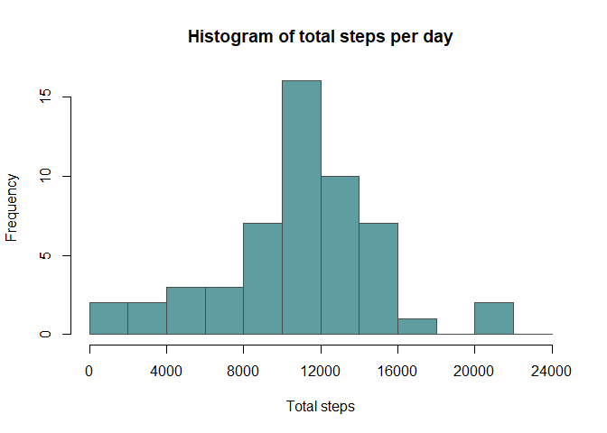
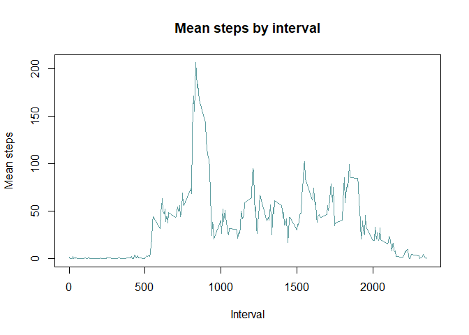
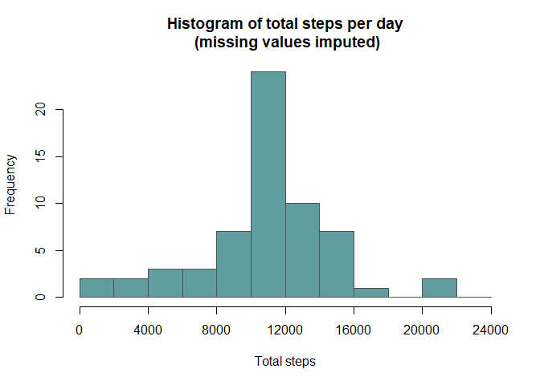
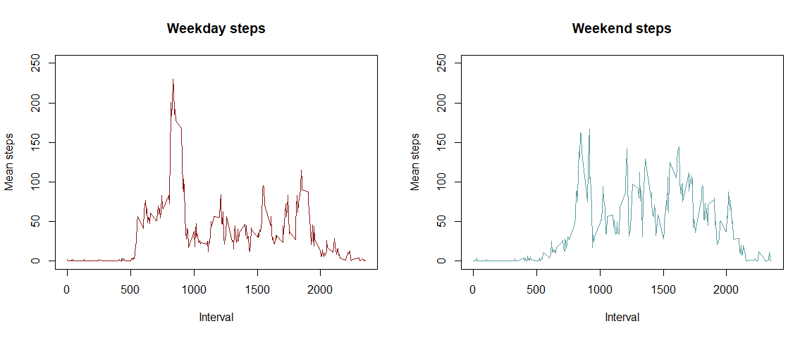

## Loading and preprocessing the data


```r
activities <- read.csv( 'activity.csv' )
```


## What is mean total number of steps taken per day?

First calculate the total steps each day (ignoring NAs) and plot as a histogram.\
We'll use breakpoints that balance prettiness and readability!

Pre-examination of the dataset shows that each date with any NA value has all NA values, 
so we don't need to deal with them explicitly using aggregate - this will keep those totals as NAs.


```r
activities$steps <- as.numeric( as.character( activities$steps ))
totSteps <- aggregate( activities$steps, by=list( activities$date ), FUN=sum )
hist( totSteps[ , 2 ], breaks = seq( 0, 24000, by = 2000 ), 
      xlim = c( 0, 24000 ), 
      xaxt = 'n', 
      main = 'Histogram of total steps per day', 
      xlab = 'Total steps',
      col = 'cadetblue',
      border = 'grey30' )
axis( 1, at = seq( 0, 24000, by = 4000 ))
```

<!-- -->


```r
meanSteps <- mean( totSteps[ ,2 ], na.rm = T )
cat( paste( 'The mean of the total steps per day is', round( meanSteps, digits = 2 ) ))
```

The mean of the total steps per day is 10766.19


```r
medSteps <- median( totSteps[ ,2 ], na.rm = T )
cat( paste( 'The median of the total steps per day is', round( medSteps, digits = 2 ) ))
```

The median of the total steps per day is 10765

## What is the average daily activity pattern?

Since the medians are zero for all days overall, we'll use the mean.
This time, we do need to deal with NAs because we're taking the means for intervals, not days.


```r
stepsByInt <- aggregate( activities$steps, by=list( activities$interval ), FUN=mean, na.rm = T )
colnames( stepsByInt ) <- c( 'interval', 'steps' )

plot( stepsByInt$interval, stepsByInt$steps, type = 'l', col = 'cadetblue',
      main = 'Mean steps by daily interval', xlab = 'Interval', ylab = 'Mean steps'  )
```

<!-- -->

```r
val <- max( stepsByInt$steps )
ans <- stepsByInt[ which( stepsByInt$steps == val ), 1 ]

cat( paste( 'Interval', ans, 'has the largest average number of steps, at', 
            round( val, digits = 2 ), 'steps on average.' ))
```

Interval 835 has the largest average number of steps, at 206.17 steps on average.


## Imputing missing values

One way of imputing data for missing values is to take the average of other points for that variable.\
For instance, for a given interval, if a value of 'steps' is missing, we can impute with the average for
that interval across the values we do have.
We'll do this with a straightforward for-loop


```r
library( knitr )
library( kableExtra )

# We already calculated indices for days with NAs above, 
# but now we need to do it by individual entry:
NAsteps <- which( is.na( activities$steps ))
cat( paste( 'The total number of missing values is', length( NAsteps )))
```

The total number of missing values is 2304

```r
# Print the first few entries:
kable_styling( kable( head( activities[ NAsteps, ])), position = 'left', full_width = F )
```

<table class="table" style="width: auto !important; ">
 <thead>
  <tr>
   <th style="text-align:right;"> steps </th>
   <th style="text-align:left;"> date </th>
   <th style="text-align:right;"> interval </th>
  </tr>
 </thead>
<tbody>
  <tr>
   <td style="text-align:right;"> NA </td>
   <td style="text-align:left;"> 2012-10-01 </td>
   <td style="text-align:right;"> 0 </td>
  </tr>
  <tr>
   <td style="text-align:right;"> NA </td>
   <td style="text-align:left;"> 2012-10-01 </td>
   <td style="text-align:right;"> 5 </td>
  </tr>
  <tr>
   <td style="text-align:right;"> NA </td>
   <td style="text-align:left;"> 2012-10-01 </td>
   <td style="text-align:right;"> 10 </td>
  </tr>
  <tr>
   <td style="text-align:right;"> NA </td>
   <td style="text-align:left;"> 2012-10-01 </td>
   <td style="text-align:right;"> 15 </td>
  </tr>
  <tr>
   <td style="text-align:right;"> NA </td>
   <td style="text-align:left;"> 2012-10-01 </td>
   <td style="text-align:right;"> 20 </td>
  </tr>
  <tr>
   <td style="text-align:right;"> NA </td>
   <td style="text-align:left;"> 2012-10-01 </td>
   <td style="text-align:right;"> 25 </td>
  </tr>
</tbody>
</table>

```r
# For each entry with an NA, we'll find the average for that interval
# Make a copy of the steps variable and replace the NAs in that to preserve the original
activities$stepsImputed <- activities$steps
for( i in 1:length( NAsteps )){
    
    int <- activities$interval[ NAsteps[i] ]
    meanInt <- stepsByInt$steps[ which( stepsByInt$interval == int ) ]
    activities$stepsImputed[ NAsteps[i] ] <- meanInt
}

# And print the first few entries again:
kable_styling( kable( head( activities[ NAsteps, ])), position = 'left', full_width = F )
```

<table class="table" style="width: auto !important; ">
 <thead>
  <tr>
   <th style="text-align:right;"> steps </th>
   <th style="text-align:left;"> date </th>
   <th style="text-align:right;"> interval </th>
   <th style="text-align:right;"> stepsImputed </th>
  </tr>
 </thead>
<tbody>
  <tr>
   <td style="text-align:right;"> NA </td>
   <td style="text-align:left;"> 2012-10-01 </td>
   <td style="text-align:right;"> 0 </td>
   <td style="text-align:right;"> 1.7169811 </td>
  </tr>
  <tr>
   <td style="text-align:right;"> NA </td>
   <td style="text-align:left;"> 2012-10-01 </td>
   <td style="text-align:right;"> 5 </td>
   <td style="text-align:right;"> 0.3396226 </td>
  </tr>
  <tr>
   <td style="text-align:right;"> NA </td>
   <td style="text-align:left;"> 2012-10-01 </td>
   <td style="text-align:right;"> 10 </td>
   <td style="text-align:right;"> 0.1320755 </td>
  </tr>
  <tr>
   <td style="text-align:right;"> NA </td>
   <td style="text-align:left;"> 2012-10-01 </td>
   <td style="text-align:right;"> 15 </td>
   <td style="text-align:right;"> 0.1509434 </td>
  </tr>
  <tr>
   <td style="text-align:right;"> NA </td>
   <td style="text-align:left;"> 2012-10-01 </td>
   <td style="text-align:right;"> 20 </td>
   <td style="text-align:right;"> 0.0754717 </td>
  </tr>
  <tr>
   <td style="text-align:right;"> NA </td>
   <td style="text-align:left;"> 2012-10-01 </td>
   <td style="text-align:right;"> 25 </td>
   <td style="text-align:right;"> 2.0943396 </td>
  </tr>
</tbody>
</table>

```r
# And make the histogram:
totStepsImp <- aggregate( activities$stepsImputed, by=list( activities$date ), FUN=sum )
hist( totStepsImp[ , 2 ], breaks = seq( 0, 24000, by = 2000 ), 
      xlim = c( 0, 24000 ), 
      xaxt = 'n', 
      main = 'Histogram of total steps per day\n (missing values imputed)', 
      xlab = 'Total steps',
      col = 'cadetblue',
      border = 'grey30' )
axis( 1, at = seq( 0, 24000, by = 4000 ))
```

<!-- -->


```r
meanSteps <- mean( totStepsImp[ ,2 ], na.rm = T )
cat( paste( 'The mean of the total steps, using imputed data, per day is', round( meanSteps, digits = 2 ) ))
```

The mean of the total steps, using imputed data, per day is 10766.19


```r
medSteps <- median( totStepsImp[ ,2 ], na.rm = T )
cat( paste( 'The median of the total steps, using imputed data, per day is', round( medSteps, digits = 2 ) ))
```

The median of the total steps, using imputed data, per day is 10766.19


The use of the mean to impute has biased results heavily towards means for each
interval, so the median and the mean are now the same!

## Are there differences in activity patterns between weekdays and weekends?

We'll convert the dates to date format, and use this to get the weekday.\
We'll use the imputed data.


```r
activities$day <- weekdays( as.Date( activities$date ))

# Now convert this into either 'weekday' or 'weekend'
daysWeek <- c( 'Monday', 'Tuesday', 'Wednesday', 'Thursday', 'Friday' )
activities$day[ which( activities$day %in% daysWeek )] <- 'Weekday'
activities$day[ which( activities$day != 'Weekday' )] <- 'Weekend'

# Aggregate by weekend/weekday and by 5-minute interval
stepsByWkInt <- aggregate( activities$stepsImputed, by=list( activities$day, activities$interval ), 
                           FUN=mean, na.rm = T )
colnames( stepsByWkInt ) <- c( 'Day', 'Interval', 'Steps' )

# Make panel plots
par( mfrow = c( 1, 2 ))
plot( stepsByWkInt$Interval[ which( stepsByWkInt == 'Weekday' )],
      stepsByWkInt$Steps[ which( stepsByWkInt == 'Weekday' )], type = 'l', ylim = c( 0, 250 ),
      col = 'firebrick4', main = 'Weekdays', xlab = 'Interval', ylab = 'Mean steps' )
plot( stepsByWkInt$Interval[ which( stepsByWkInt == 'Weekend' )],
      stepsByWkInt$Steps[ which( stepsByWkInt == 'Weekend' )], type = 'l', ylim = c( 0, 250 ),
      col = 'cadetblue', main = 'Weekends', xlab = 'Interval', ylab = 'Mean steps')
```

<!-- -->
